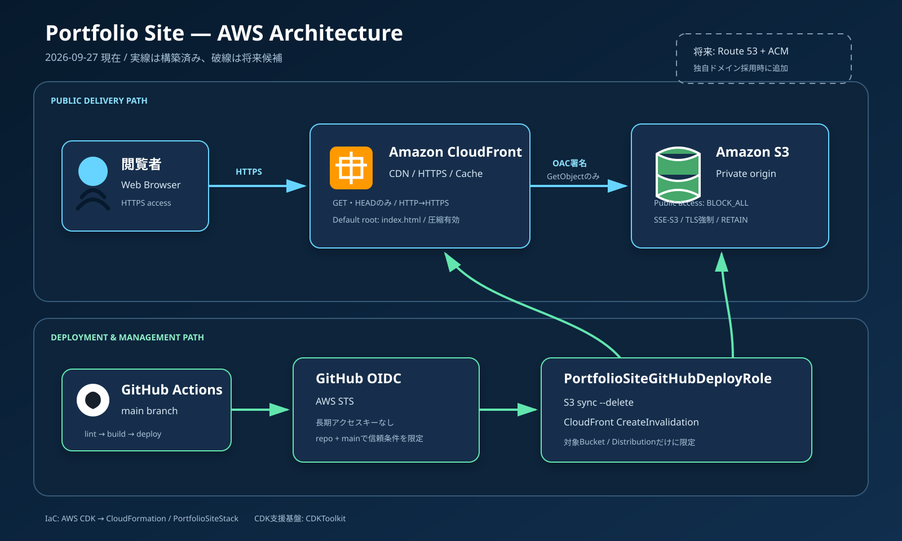

# AWS構成設計書

最終更新日: 2026-09-27
構築状態: 実装・デプロイ済み

## 1. 目的

本書は、ポートフォリオサイトのAWS配信基盤、セキュリティ境界、IaC（Infrastructure as Code: インフラをコードで管理する方式）、運用上の責任範囲を定義します。



## 2. 結論

AWS版は、静的ファイルを非公開のAmazon S3に保存し、Amazon CloudFrontからHTTPS配信します。CloudFrontはOAC（Origin Access Control）を使ってS3へ署名付きアクセスを行うため、閲覧者はS3へ直接アクセスできません。

GitHub ActionsはOIDC（OpenID Connect）でAWSの専用IAMロールを一時的に引き受け、S3同期とCloudFrontキャッシュ無効化だけを実行します。長期アクセスキーは使用しません。

## 3. 対象環境

| 項目 | 値 |
| --- | --- |
| AWSアカウント | `947501356968` |
| 主リージョン | `ap-northeast-1`（東京） |
| CDKスタック | `PortfolioSiteStack` |
| CDK Bootstrapスタック | `CDKToolkit` |
| S3バケット | `portfoliositestack-sitebucket397a1860-zjcfwm36ko0g` |
| CloudFrontディストリビューション | `E2B6RWLK35KKQ1` |
| CloudFrontドメイン | `d2ee4b3vm96nrw.cloudfront.net` |
| GitHubデプロイロール | `PortfolioSiteGitHubDeployRole` |

AWSアカウントIDやリソースIDは秘密情報ではありませんが、権限を持つ認証情報ではありません。秘密鍵、SSOトークン、アクセスキーは文書へ記載しません。

## 4. リソース一覧

| 論理要素 | AWSリソース | 役割 | 管理元 |
| --- | --- | --- | --- |
| サイト保存先 | S3 Bucket | `dist/`の静的ファイルを保存 | CDK |
| バケットポリシー | S3 Bucket Policy | 非TLS拒否、CloudFrontからの読取許可 | CDKが自動生成 |
| CDN | CloudFront Distribution | HTTPS配信、圧縮、キャッシュ | CDK |
| オリジン認証 | CloudFront OAC | CloudFrontからS3への署名付きアクセス | CDKが自動生成 |
| GitHub認証 | IAM OIDC Provider | GitHub ActionsのトークンをAWSが信頼 | CDK |
| デプロイ権限 | IAM Role + Inline Policy | 対象S3同期と対象CloudFront無効化 | CDK |
| デプロイ管理 | CloudFormation Stack | `PortfolioSiteStack`の作成・更新履歴 | CDKが利用 |
| CDK支援基盤 | `CDKToolkit` Stack | CDKテンプレート・アセット公開用リソース | CDK Bootstrap |

## 5. 配信フロー

```text
1. 閲覧者がCloudFront URLへHTTPSでアクセス
2. CloudFront Edgeにキャッシュがあれば、その場で応答
3. キャッシュがなければ、CloudFrontがOACでリクエストへ署名
4. S3バケットポリシーが、対象CloudFrontディストリビューションからのGetObjectだけを許可
5. S3のオブジェクトをCloudFrontが取得し、閲覧者へ返す
6. CloudFrontが後続リクエスト向けにキャッシュ
```

S3の静的Webサイトホスティング機能は使用しません。通常のS3 RESTオリジンを使うことで、OACと非公開バケットを組み合わせます。

## 6. S3設計

`infra/lib/portfolio-site-stack.ts`の`SiteBucket`で定義します。

| 設定 | CDK値 | 目的 |
| --- | --- | --- |
| 公開アクセス | `BlockPublicAccess.BLOCK_ALL` | ACL・バケットポリシー経由の意図しない公開を防ぐ |
| 暗号化 | `BucketEncryption.S3_MANAGED` | SSE-S3（AES-256）で保存時暗号化 |
| TLS強制 | `enforceSSL: true` | `aws:SecureTransport=false`をDenyするポリシーを生成 |
| 削除方針 | `RemovalPolicy.RETAIN` | Stack削除や置換時もデータを保持 |
| バケット名 | 自動生成 | アカウント内で一意な物理名をCloudFormationに任せる |
| Webサイトホスティング | 無効 | S3を直接公開しない |

### 6.1 バケットポリシー

CDKにより少なくとも次の2種類のStatementが生成されます。

1. 非TLS通信に対する`Deny s3:*`
2. 対象CloudFrontディストリビューションを`AWS:SourceArn`条件にした`Allow s3:GetObject`

2つ目はCloudFrontサービス全体を無条件に許可せず、このサイトのディストリビューションだけに限定します。

### 6.2 RETAINの注意点

`RETAIN`により誤削除の危険は下がりますが、Stackを削除してもS3バケットと中身が残る場合があります。不要になった際は、所有者が内容とバックアップ要否を確認してから明示的に削除します。

## 7. CloudFront設計

`SiteDistribution`で定義します。

| 設定 | 値 |
| --- | --- |
| オリジン | `SiteBucket`のS3 RESTエンドポイント |
| オリジンアクセス | OAC |
| デフォルトルート | `index.html` |
| Viewer Protocol Policy | HTTPをHTTPSへリダイレクト |
| 許可メソッド | GET、HEAD |
| キャッシュ対象 | GET、HEAD |
| キャッシュポリシー | `CACHING_OPTIMIZED` |
| 圧縮 | 有効 |
| 独自ドメイン | 未設定 |
| アクセスログ | 未設定 |

価格クラス、HTTPバージョンなど一部はCDKコードで明示せず既定値を使用しています。設定を固定したい場合は、まず`cdk diff`で影響を確認してからコードへ追加します。

### 7.1 キャッシュ更新

サイトデプロイ後、GitHub Actionsが次を実行します。

```text
CreateInvalidation
Distribution: E2B6RWLK35KKQ1
Paths: /*
```

全パス無効化は小規模サイトでは分かりやすい方式です。更新頻度や費用が増えた場合は、`index.html`だけを短期キャッシュにするなどの最適化を検討します。

## 8. GitHub OIDC・IAM設計

### 8.1 OIDC Provider

| 設定 | 値 |
| --- | --- |
| Provider URL | `https://token.actions.githubusercontent.com` |
| Audience | `sts.amazonaws.com` |

### 8.2 信頼ポリシー

GitHubデプロイロールは`sts:AssumeRoleWithWebIdentity`を許可し、次の条件で絞り込みます。

| Claim | 許可値 |
| --- | --- |
| `aud` | `sts.amazonaws.com` |
| `sub` | `repo:nozomuorita/portfolio-site:ref:refs/heads/main` |

このため、別リポジトリや別ブランチのWorkflowはこのロールを引き受けられません。

### 8.3 権限ポリシー

| 対象 | 許可Action | 用途 |
| --- | --- | --- |
| サイトバケット | `GetBucketLocation`、`ListBucket`、`ListBucketMultipartUploads` | 同期前の一覧・場所確認 |
| サイトバケット配下 | `GetObject`、`PutObject`、`DeleteObject`、`AbortMultipartUpload`、`ListMultipartUploadParts` | `aws s3 sync --delete` |
| 対象CloudFront | `CreateInvalidation` | 更新後のキャッシュ削除 |

IAMロールにはCDKやCloudFormationを変更する権限を与えていません。アプリケーションの公開とインフラ変更を分離する設計です。

## 9. CDK設計

### 9.1 ファイル責務

| ファイル | 責務 |
| --- | --- |
| `infra/cdk.json` | CDK CLIが実行するアプリの指定 |
| `infra/bin/portfolio-site.ts` | CDK AppとStackの生成、環境、共通タグ |
| `infra/lib/portfolio-site-stack.ts` | AWSリソース本体の定義 |
| `infra/tsconfig.json` | TypeScript検査設定 |
| `infra/package.json` | CDK依存関係と実行スクリプト |
| `infra/LEARNING_ROADMAP.md` | 学習単位と構築履歴 |

### 9.2 Stack環境

- account: `CDK_DEFAULT_ACCOUNT`
- region: `CDK_DEFAULT_REGION`、未指定時は`ap-northeast-1`
- description: `AWS CDK learning stack for the portfolio site`
- tags: `Project=portfolio-site`、`ManagedBy=AWS-CDK`

### 9.3 Bootstrap

`CDKToolkit`は、このサイトのアプリケーションStackではなく、CDKがデプロイ時にテンプレートやアセットを受け渡すための支援Stackです。アカウント・リージョンごとに事前構築し、ステージング用S3、ECR、IAMロール、SSMパラメーター等を持ちます。

## 10. セキュリティ境界

| 経路 | 制御 |
| --- | --- |
| 閲覧者 → CloudFront | HTTPSへリダイレクト、GET/HEADのみ |
| CloudFront → S3 | OAC署名、対象DistributionのSourceArn条件 |
| 一般利用者 → S3 | パブリックアクセスブロックにより拒否 |
| GitHub Actions → AWS STS | OIDC、`main`ブランチ条件、短期認証情報 |
| GitHub Actions → S3 | 対象バケットだけ |
| GitHub Actions → CloudFront | 対象DistributionのInvalidationだけ |
| 管理者 → AWS | IAM Identity Centerの`codex-admin`。変更時のみ利用 |
| 調査 → AWS | IAM Identity Centerの`codex-readonly`を原則利用 |

## 11. 監視・費用

- CloudFrontのリクエスト数、転送量、エラー率などの基本メトリクスは標準で確認できます。
- CloudFront標準アクセスログは未設定で、個々のリクエスト追跡や詳細分析はできません。
- AWS Budgetsによるゼロ支出・月額予算通知、およびCost Anomaly Detectionが設定済みです。
- CloudWatch Billing Alarmは未設定ですが、現段階では既存の予算通知を主な料金監視とします。
- S3、CloudFront、無効化リクエスト等は従量課金です。小規模サイトでも無料とは断定せず、請求画面と予算通知を確認します。

## 12. 未導入・将来候補

| 項目 | 現在の判断 |
| --- | --- |
| Route 53 | 独自ドメイン採用時に検討 |
| ACM | 独自ドメイン採用時、CloudFront用証明書を`us-east-1`で作成 |
| CloudFront標準ログ | 障害分析やアクセス分析が必要になったら追加 |
| WAF | 公開規模・脅威・費用を見て検討 |
| Contact API | 静的な連絡手段では不足する場合に検討 |
| CodePipeline | GitHub Actionsで要件を満たすため現時点では採用しない |

## 13. 公式参考資料

- [AWS: S3オリジンへのアクセスを制限する](https://docs.aws.amazon.com/AmazonCloudFront/latest/DeveloperGuide/private-content-restricting-access-to-s3.html)
- [AWS CDK: Bootstrap your environment](https://docs.aws.amazon.com/cdk/v2/guide/bootstrapping-env.html)
- [AWS: CloudFrontのファイル無効化](https://docs.aws.amazon.com/AmazonCloudFront/latest/DeveloperGuide/Invalidation.html)
- [GitHub: AWSでOpenID Connectを構成する](https://docs.github.com/en/actions/how-tos/secure-your-work/security-harden-deployments/oidc-in-aws)
