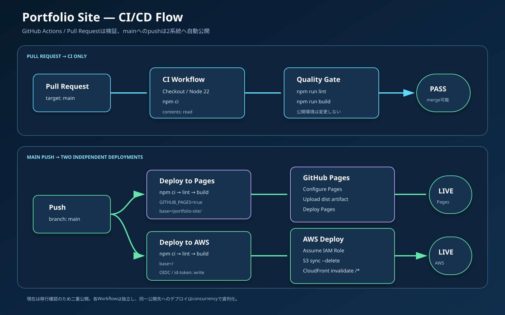

# CI/CD・デプロイ設計書

最終更新日: 2026-09-27
現行方式: GitHub ActionsからGitHub PagesとAWSへ並行デプロイ

## 1. 目的

本書は、ソース変更を検証して公開する流れ、GitHub Actions各Workflowの責務、AWS認証、失敗時の確認、切戻し方法を定義します。



## 2. CIとCDの定義

- CI（Continuous Integration）: 変更を継続的に取り込み、lintやbuildで品質を検証すること。
- CD（Continuous Delivery/Deployment）: 検証済み成果物を公開環境へ届けること。

本リポジトリでは、Pull RequestでCIだけを実行し、`main`へのpushでCI相当の検証と2系統のデプロイを実行します。

## 3. Workflow一覧

| ファイル | 起動条件 | 目的 | 外部への変更 |
| --- | --- | --- | --- |
| `.github/workflows/ci.yml` | `main`向けPull Request、手動 | lint・build | なし |
| `.github/workflows/deploy-pages.yml` | `main`へのpush、手動 | GitHub Pagesへ公開 | Pages環境を更新 |
| `.github/workflows/deploy-aws.yml` | `main`へのpush、手動 | S3・CloudFrontへ公開 | S3同期、キャッシュ無効化 |

`main`へのpushではPagesとAWSのWorkflowが独立して起動します。一方が成功しても、他方の成功を保証しません。

## 4. Pull RequestのCI

`ci.yml`の処理順です。

1. `actions/checkout@v7`で対象コミットを取得
2. `actions/setup-node@v7`でNode.js 22とnpmキャッシュを準備
3. `npm ci`でlockfileどおり依存関係をインストール
4. `npm run lint`で静的検査
5. `npm run build`で本番ビルドと`404.html`生成

権限は`contents: read`だけです。デプロイ権限を持たないため、Pull Requestの検証で公開環境を書き換えません。

同じWorkflow・Git refの実行は`cancel-in-progress: true`で、古い検証を中止して新しい変更を優先します。

## 5. GitHub Pagesデプロイ

### 5.1 フロー

```text
mainへpush
  → Checkout
  → Node.js 22
  → npm ci
  → npm run lint
  → Configure Pages
  → GITHUB_PAGES=true npm run build
  → distをPages artifactとしてupload
  → github-pages環境へdeploy
```

### 5.2 権限

| 権限 | 用途 |
| --- | --- |
| `contents: read` | ソース取得 |
| `pages: write` | GitHub Pagesへの公開 |
| `id-token: write` | Pagesデプロイで利用するOIDCトークン |

### 5.3 Vite base

GitHub Pagesのリポジトリサイトは`/<repository>/`配下になるため、WorkflowのBuildだけ`GITHUB_PAGES=true`を設定します。`vite.config.js`はこの値を見て`base: '/portfolio-site/'`を使用します。

### 5.4 Artifact

`actions/upload-pages-artifact@v5`が`dist/`をPages用Artifactとしてアップロードし、`actions/deploy-pages@v5`が`github-pages`環境へ公開します。Gitの`docs/`ディレクトリは公開成果物ではなく、設計文書専用です。

## 6. AWSデプロイ

### 6.1 フロー

```text
mainへpush
  → Checkout
  → Node.js 22
  → npm ci
  → npm run lint
  → npm run build（base=/）
  → GitHub OIDCトークンを取得
  → PortfolioSiteGitHubDeployRoleを一時的に引受
  → aws s3 sync dist s3://... --delete
  → aws cloudfront create-invalidation --paths "/*"
```

### 6.2 Workflow環境値

| 変数 | 値・役割 |
| --- | --- |
| `AWS_REGION` | `ap-northeast-1` |
| `AWS_ROLE_ARN` | GitHub Actions専用IAMロール |
| `SITE_BUCKET` | 配信元S3バケット |
| `CLOUDFRONT_DISTRIBUTION_ID` | 更新対象CloudFront |

### 6.3 認証

Workflow権限は`contents: read`と`id-token: write`です。`aws-actions/configure-aws-credentials@v6.3.0`がGitHubのOIDCトークンをAWS STSへ渡し、一時認証情報を取得します。

`allowed-account-ids: "947501356968"`により、意図しないAWSアカウントの認証情報を受け取った場合は失敗させます。

### 6.4 S3同期

```powershell
aws s3 sync dist "s3://${SITE_BUCKET}" `
  --delete `
  --region "${AWS_REGION}" `
  --no-progress
```

`--delete`により、現在の`dist/`に存在しない古いオブジェクトをS3から削除します。これにより、ハッシュが変わった古いアセットが蓄積しません。一方で誤った空の成果物を同期すると削除が起こり得るため、必ずbuild成功後だけ実行します。

### 6.5 CloudFront無効化

S3更新後に`/*`を無効化し、Edge Cacheに残る旧コンテンツを順次更新します。無効化完了には時間がかかる場合があります。

## 7. 並行公開の位置づけ

現在は移行確認期間として、同じ`main`から次の2つを公開します。

| 公開先 | 用途 | 状態 |
| --- | --- | --- |
| GitHub Pages | 従来の公開先、比較・切戻し先 | 稼働中 |
| AWS CloudFront | 移行先、AWS学習・運用対象 | 稼働中 |

AWS版を正式公開先と確定した後、GitHub Pages Workflowの停止または削除を検討します。その際は公開URL、README、要件、テスト、運用手順を同時に更新します。

## 8. 旧方式と変更理由

### 8.1 旧方式

以前はローカルでViteをbuildし、`dist/`の内容をGitHub Pages公開用の`docs/`へコピーしてcommit・pushする運用を想定していました。

```text
ローカルでbuild
  → distをdocsへコピー
  → 生成物をcommit
  → push
  → GitHub Pagesがdocsを公開
```

### 8.2 旧方式の課題

- `dist/`から`docs/`へのコピー漏れが起きる。
- ソースと生成物のcommitが混在する。
- ローカル環境差により公開成果物が変わる。
- Git履歴にハッシュ付き生成物が大量に残る。
- `docs/`を設計文書の置き場所として使えない。

### 8.3 現行方式の効果

- GitHub上の同一環境で毎回buildする。
- 生成物をリポジトリへcommitしない。
- `docs/`を純粋な文書ディレクトリとして利用できる。
- pushしたコミットとWorkflow実行結果を対応付けられる。

## 9. 日常の開発・公開手順

```powershell
# リポジトリルート
npm ci                 # lockfile更新がない通常作業では初回または必要時
npm run lint
npm run build
npm run preview        # 必要に応じ http://localhost:4173 で確認
```

確認後、変更をcommitして`main`へpushすると自動公開されます。Pull Requestを使う場合は、PRのCI成功を確認してからmergeします。

## 10. 成功確認

### 10.1 GitHub Actions

- `CI`、`Deploy to GitHub Pages`、`Deploy to AWS`の対象Runが緑色で完了している。
- AWS Workflowでは`Configure AWS credentials`、`Sync site to S3`、`Invalidate CloudFront cache`がすべて成功している。

### 10.2 GitHub Pages

- ActionsのDeployment URLを開ける。
- CSS・JavaScript・画像が`/portfolio-site/`配下から読み込まれる。

### 10.3 AWS

- CloudFront URLがHTTP 200を返す。
- 更新内容が表示される。
- S3に最新の`index.html`とハッシュ付きアセットが存在する。
- 必要に応じてCloudFront InvalidationのStatusが`Completed`になっている。

## 11. 失敗時の切り分け

| 失敗Step | 主な原因 | 確認方法 |
| --- | --- | --- |
| Checkout | 権限、リポジトリ一時障害 | Actionsログ、GitHub Status |
| Setup Node | ActionまたはNode指定 | Workflowのバージョン、Node 22 |
| npm ci | lockfile不整合、ネットワーク、Node不一致 | ローカルで`npm ci` |
| Lint | ESLint違反 | ログのファイル・行番号を修正 |
| Build | import不整合、構文、メモリ | ローカルで`npm run build` |
| Configure Pages | Pages設定・権限 | Settings > Pages、Workflow permissions |
| AWS credentials | OIDC信頼条件、Role ARN、Audience | IAM信頼ポリシーと対象branch |
| S3 sync | IAM権限、バケット名、成果物 | Role policy、`dist/`、AWSログ |
| Invalidation | Distribution ID、IAM権限 | CloudFront ID、CreateInvalidation権限 |
| 表示が古い | キャッシュ無効化進行中、ブラウザキャッシュ | Invalidation状態、ハードリロード |
| AWSだけ白画面 | Vite baseまたはアセット404 | DevTools Network、`base: '/'` |
| Pagesだけ白画面 | `GITHUB_PAGES=true`不足 | buildログ、生成HTMLのパス |

## 12. ロールバック

履歴を書き換えず、正常コミットを戻す新しいcommitを作り、`main`へpushする方法を基本とします。

```powershell
git log --oneline
git revert <problem-commit>
git push origin main
```

push後、PagesとAWSの両Workflowが再実行されます。緊急時に過去コミットを手動実行したい場合も、最終的には`main`と公開内容が一致するようにします。

## 13. 同時実行制御

- Pages: `group: pages`、`cancel-in-progress: false`
- AWS: `group: aws-production`、`cancel-in-progress: false`

公開処理の途中キャンセルを避け、同じ環境へのデプロイを直列化します。短時間に複数pushした場合、古い実行が完了してから新しい実行が進むことがあります。

## 14. CodePipelineを採用しない理由

現状の規模では、GitHub Actionsだけで次を満たします。

- GitHubのpushを直接起点にできる。
- OIDCで安全にAWSへ接続できる。
- lint、build、S3同期、CloudFront無効化を一つの履歴で確認できる。
- 追加のパイプラインサービス構成を学習・運用する負担が少ない。

複数環境、手動承認、組織標準、複雑なAWS内連携が必要になった場合にCodePipelineを再検討します。

## 15. 公式参考資料

- [GitHub: GitHub PagesでカスタムWorkflowを使う](https://docs.github.com/en/pages/getting-started-with-github-pages/using-custom-workflows-with-github-pages)
- [GitHub: AWSでOpenID Connectを構成する](https://docs.github.com/en/actions/how-tos/secure-your-work/security-harden-deployments/oidc-in-aws)
- [Vite: Deploying a Static Site](https://vite.dev/guide/static-deploy.html)
- [AWS: CloudFrontのファイル無効化](https://docs.aws.amazon.com/AmazonCloudFront/latest/DeveloperGuide/Invalidation.html)
