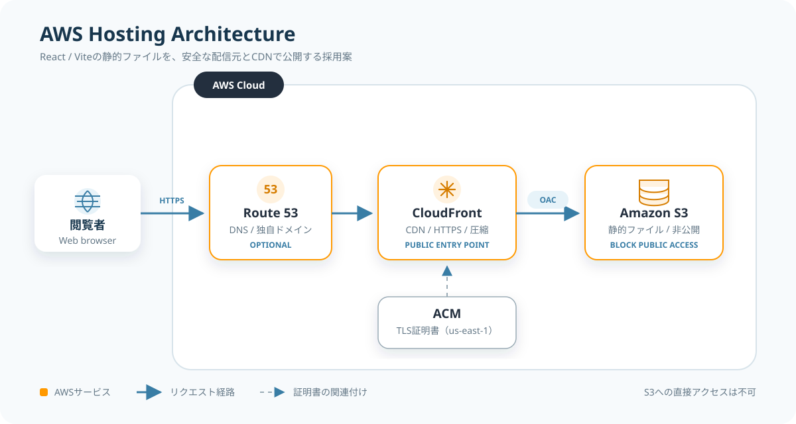
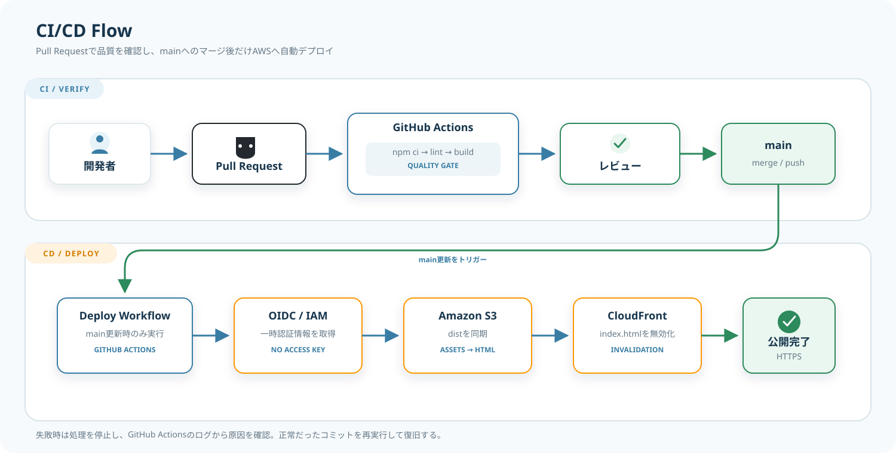
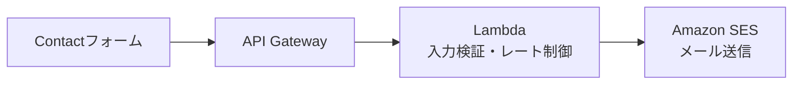

# 技術・AWS構成設計書

最終更新日: 2026-09-21

## 1. 設計方針

現状のReact構成を維持し、Viteで生成した静的ファイルをAWSから配信します。サーバー側レンダリングやデータベースは使用しません。

Reactが絶対に必要なサイトではありませんが、制作物モーダル、データ配列からのカード生成、BGM状態、将来の更新性を考えると、刷新時にHTMLへ戻す利益は小さいため維持します。ただし、状態管理ライブラリやフルスタックフレームワークは追加しません。

## 2. 現行技術構成

| 分類 | 現状 | 方針 |
| --- | --- | --- |
| UI | React 18 | 維持 |
| ビルド | Vite 4 | 維持し、更新は別作業で検討 |
| CSS | Bootstrap、独自CSS | 維持しつつ重複を整理 |
| コンポーネント | MUI Icons、React Bootstrap | 使用箇所を確認し、不要依存を削除 |
| 配信 | GitHub Pages | AWSへ移行 |
| ルーティング | ページ内アンカー | 維持。React Routerは不要 |
| データ | JSXファイル内の配列 | 当面維持。量が増えたらJSON等へ分離 |

## 3. フロントエンド構成

### 3.1 推奨ディレクトリ

```text
src/
├─ assets/
│  ├─ about/            # 経歴、学会発表、論文
│  ├─ brand/            # ロゴ
│  ├─ contact/          # Contact背景
│  ├─ hero/             # Hero動画、BGM
│  ├─ icons/            # サイト固有アイコン
│  ├─ portfolio/        # 制作物画像
│  ├─ profile/          # プロフィール画像
│  ├─ qualifications/   # 資格画像
│  └─ skills/           # スキル画像
├─ components/          # 共通UI
├─ App.jsx
└─ main.jsx
documentation/assets/    # 設計書用の図
.github/workflows/       # CI/CDワークフロー
dist/                    # Vite生成物（Git管理対象外）
```

アプリケーションが使用する素材は`src/assets`へ集約し、ReactまたはCSSからimportします。固定URLで配信する必要がある素材が生じた場合のみ`public`を作成します。未使用だが保管する素材は、誤ってビルドやGit管理の対象にしないようリポジトリ外へ分離します。

### 3.2 コンポーネント責務

| 単位 | 責務 |
| --- | --- |
| `App` | 全体レイアウトと共通スタイルの読込み |
| `Header` | サイト内移動、モバイルメニュー、BGM操作 |
| `Hero` | 背景動画、氏名、AboutへのCTA |
| 各Section | セクション固有の表示だけを担当 |
| `ProjectCard` | 制作物の要約表示 |
| `ProjectModal` | 制作物の詳細表示 |
| `Footer` | 外部プロフィール、著作権、先頭への移動 |

制作物、資格、スキルは、表示処理とデータを分離します。新しい項目を追加するときに、JSX構造を複製せずデータ追加だけで済む状態を目標にします。

### 3.3 ビルド仕様

| 項目 | 値 |
| --- | --- |
| インストール | `npm ci` |
| 静的解析 | `npm run lint` |
| 本番ビルド | `npm run build` |
| 成果物 | `dist/` |
| Node.js | GitHub Actionsとローカルで同じLTSメジャーバージョンに固定 |

GitHub Pagesへの公開時だけViteの`base`を`/portfolio-site/`に切り替えます。ローカルとAWSでは`/`を使用し、GitHub Pages用の条件分岐はAWS移行完了後に削除します。

現在のGitHub Pagesでは、`main`へのpushを契機にGitHub Actionsが`npm ci`、lint、production buildを実行し、`dist/`を直接デプロイします。ビルド成果物を`docs/`へコピーしてGit管理する運用は廃止します。

GitHub Pages用ワークフローの各処理、旧方式からの変更点、日常運用と障害対応は[04-github-pages-ci-cd.md](04-github-pages-ci-cd.md)を参照してください。

## 4. AWS構成の結論

このプロジェクトでは、次の構成を推奨します。

- **Amazon S3:** ビルド成果物を非公開で保管
- **Amazon CloudFront:** HTTPS配信、CDNキャッシュ、S3への唯一の公開経路
- **Origin Access Control（OAC）:** CloudFrontだけにS3の読取りを許可
- **AWS Certificate Manager（ACM）＋Route 53:** 独自ドメインを使う場合の証明書とDNS
- **GitHub Actions＋OIDC:** 長期AWSアクセスキーを保存せず自動デプロイ



独自ドメインを使わない場合は、Route 53と独自証明書を省略し、CloudFront標準ドメインから公開できます。

## 5. この構成を選ぶ理由

### 5.1 S3単体の静的Webサイトホスティングを採用しない理由

Reactのビルド成果物はS3だけでも公開できますが、S3のWebサイトエンドポイントを直接公開すると、配信元を公開状態にする設計になりやすく、HTTPSや独自ドメイン対応も別途必要です。

本設計では通常のS3バケットを非公開のままCloudFrontのオリジンにし、OACでCloudFrontからの読取りだけを許可します。AWSもOAIよりOACを推奨しており、OACはS3のWebサイトエンドポイントではなく通常のS3バケットオリジンで使用します。  
参考: [AWS - Restrict access to an Amazon S3 origin](https://docs.aws.amazon.com/AmazonCloudFront/latest/DeveloperGuide/private-content-restricting-access-to-s3.html)

### 5.2 Amplify Hostingとの比較

| 観点 | S3 + CloudFront（採用案） | Amplify Hosting |
| --- | --- | --- |
| 初期設定 | やや多い | 少ない |
| Git連携 | GitHub Actionsを自分で構成 | 標準機能で簡単 |
| AWS学習・構成の可視性 | 高い | 内部構成が抽象化される |
| キャッシュ等の細かな制御 | しやすい | 管理機能の範囲内 |
| 運用負荷 | 少し高い | 低い |

最短で公開することだけを優先するならAmplify Hostingも妥当です。AmplifyはCDN、HTTPS、カスタムドメイン、ログ・メトリクスをまとめて提供します。  
参考: [AWS - Deploying a static website to Amplify from an Amazon S3 bucket](https://docs.aws.amazon.com/amplify/latest/userguide/deploy-website-from-s3.html)

今回は「AWSを使った構成自体もポートフォリオにする」価値があるため、S3 + CloudFrontを採用案とします。

## 6. AWSリソース設計

### 6.1 S3

| 項目 | 設定 |
| --- | --- |
| 公開アクセス | Block Public Accessをすべて有効 |
| Static website hosting | 無効 |
| Object Ownership | Bucket owner enforced |
| バージョニング | 任意。Gitから再生成できるため初期は無効でもよい |
| 暗号化 | S3管理キーによるサーバー側暗号化 |
| バケットポリシー | 対象CloudFront distributionからの`GetObject`だけ許可 |

### 6.2 CloudFront

| 項目 | 設定 |
| --- | --- |
| Origin | 通常のS3バケットエンドポイント |
| Origin access | OAC、署名設定は`always` |
| Default root object | `index.html` |
| Viewer protocol | HTTPからHTTPSへリダイレクト |
| Allowed methods | `GET`、`HEAD`、必要に応じて`OPTIONS` |
| 圧縮 | Brotli/Gzipを有効化 |
| HTTP version | HTTP/2とHTTP/3を許可 |
| Price class | 主な閲覧地域と費用を見て選択 |

現状はページ内アンカーだけであり、URLパスによるクライアントルーティングはありません。そのため、すべての404を`index.html`へ書き換えるSPA用設定は不要です。React Routerを導入した場合に追加設計します。

### 6.3 ドメイン・証明書

- Route 53のHosted Zoneで独自ドメインを管理する。
- apexドメインまたは`www`からCloudFrontへAliasレコードを設定する。
- CloudFrontで使用するACM証明書は`us-east-1`リージョンで発行する。
- 証明書の対象名とCloudFrontのAlternate domain nameを一致させる。

CloudFront用ACM証明書のリージョン要件はAWS公式仕様に基づきます。  
参考: [AWS - Requirements for using SSL/TLS certificates with CloudFront](https://docs.aws.amazon.com/AmazonCloudFront/latest/DeveloperGuide/cnames-and-https-requirements.html)

## 7. CI/CD設計

`main`ブランチへのpushを本番デプロイの起点とします。Pull Requestではlintとbuildだけを行い、AWSへは反映しません。



### 7.1 CodePipelineを採用しない理由

初期構成ではCodePipelineを使用せず、GitHub ActionsをCI/CD全体の実行基盤とします。静的サイトを単一の本番環境へ配信する現在の規模では、GitHub Actionsだけで検証、ビルド、S3同期、CloudFrontのキャッシュ無効化まで完結するためです。

CodePipelineを併用すると、GitHubとAWSの両方にパイプライン定義・実行履歴・権限設定が分かれます。現段階では、AWSサービスを増やす利点より運用箇所が増える影響の方が大きいと判断します。

将来、開発・検証・本番の複数環境、AWS上の手動承認、組織的な監査、CodeBuildやCodeDeployを含むAWS中心のリリース管理が必要になった場合は再検討します。

参考: [AWS - What can I do with CodePipeline?](https://docs.aws.amazon.com/codepipeline/latest/userguide/welcome-what-can-I-do.html) / [AWS - GitHub connections](https://docs.aws.amazon.com/codepipeline/latest/userguide/connections-github.html)

GitHub ActionsからAWSへはOpenID Connect（OIDC）を使用します。これにより、GitHub Secretsへ長期間有効なAWSアクセスキーを保存せず、一時的な認証情報を取得できます。  
参考: [GitHub Docs - Configuring OpenID Connect in Amazon Web Services](https://docs.github.com/en/actions/how-tos/secure-your-work/security-harden-deployments/oidc-in-aws)

### 7.2 IAM権限

デプロイ用IAMロールには、対象を限定して次だけを許可します。

- 対象S3バケットのオブジェクト一覧、追加、更新、削除
- 対象CloudFront distributionのInvalidation作成
- その他のバケット、distribution、IAM操作は許可しない
- 信頼ポリシーで対象GitHubリポジトリと`main`ブランチを限定する

### 7.3 キャッシュ制御

| 対象 | 推奨Cache-Control | 理由 |
| --- | --- | --- |
| `index.html` | `no-cache`または短時間 | 新しいファイル名を早く参照させる |
| ハッシュ付きJS/CSS | `public, max-age=31536000, immutable` | 内容変更時にファイル名が変わる |
| 画像・動画 | ファイル名管理に応じて長期 | 容量が大きく再取得コストが高い |

デプロイでは、資産ファイルを先にアップロードし、最後に`index.html`を更新します。通常は`index.html`だけをInvalidation対象にし、緊急時のみ`/*`を使用します。

## 8. Contactを将来実装する場合

初期リリースでは対象外です。実装する場合は、静的サイトとは別に次の構成を追加します。



追加で必要になるものは、入力値検証、CORS、送信元ドメイン検証、レート制限、CAPTCHA等のBot対策、ログへ個人情報を残さない設定、プライバシーポリシーです。これらを用意せずにフォームだけ有効化しません。

## 9. 監視・運用

| 項目 | 初期対応 |
| --- | --- |
| デプロイ監視 | GitHub Actionsの失敗通知 |
| 死活確認 | デプロイ後にCloudFront URLへHTTP確認 |
| 費用監視 | AWS Budgetsで月額の通知を設定 |
| アクセスログ | 初期は任意。必要になったらCloudFrontログを有効化 |
| 障害復旧 | 正常だったGitコミットを再デプロイ |
| コンテンツ更新 | Gitで修正しPull Requestまたはmainへ反映 |

個人サイトでは24時間の有人監視や厳密なSLA（サービス品質保証）は設けません。

## 10. 移行手順

1. 本番表示に不要なContact、ダミーリンク、壊れたナビゲーションを整理する。
2. 画像・動画を最適化し、lint・build・主要画面確認を完了する。
3. S3、CloudFront、OACを構築し、CloudFront標準ドメインで確認する。
4. GitHub Actions OIDCと自動デプロイを構築する。
5. 必要ならRoute 53とACMで独自ドメインを設定し、確認後にGitHub Pagesを停止する。

## 11. Infrastructure as Code

AWS構築時は、コンソールで一度きりの設定を積み重ねず、AWS CDKまたはTerraformで管理することを推奨します。初期候補は、既存のJavaScript知識を利用できるAWS CDK（TypeScript）です。

ただし、IaCの導入はサイト内容の刷新を妨げない順番で行います。最初に画面を完成させ、その後にAWS構成をコード化します。

## 12. 実装前の決定事項

1. 独自ドメインの有無とドメイン名。
2. AWSリソースをCDKとTerraformのどちらで管理するか。
3. 本番反映を`main`への直接pushとPull Request mergeのどちらに限定するか。
